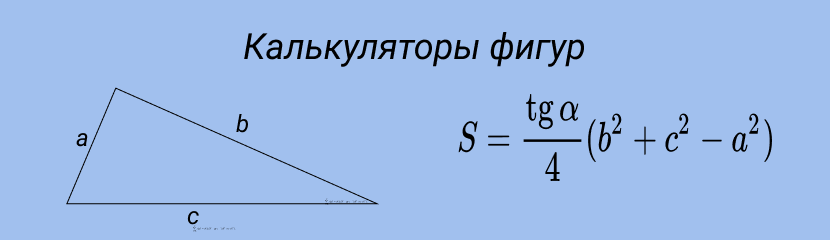
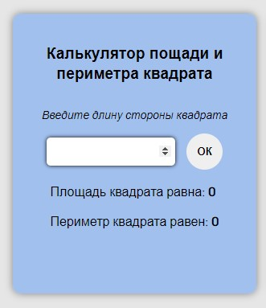
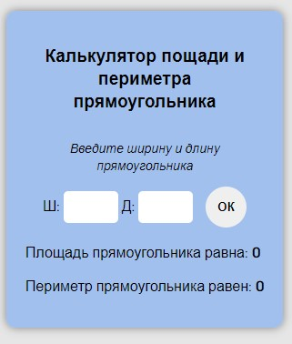
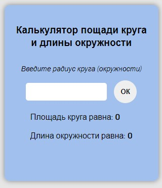
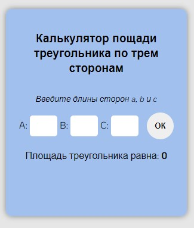

<h1 align="center">Калькуляторы фигур</h1>

<h2 align="center">Описание</h2>

Четыре калькулятора для вычисления параметров геометрических фигур:

1. Калькулятор площади и периметра квадрата

2. Калькулятор площади и периметра прямоугольника

3. Калькулятор площади круга и длины окружности

4. Калькулятор площади треугольника по трем сторонам

<h2 align="center">Как использовать</h2>

Просто вводим параметры фигуры в нужный калькулятор, нажимаем ОК, получаем результат.

<h2 align="center">Технологии</h2>

В этом проекте использовались: 
* HTML
* CSS
* JavaScript

<h2 align="center">Дополнительно</h2>

Проект создавался как практика к [этому учебнику](http://code.mu/ru/javascript/book/practice/)

***

Посмотреть можно [тут](https://natalielinen.github.io/calculators/)

